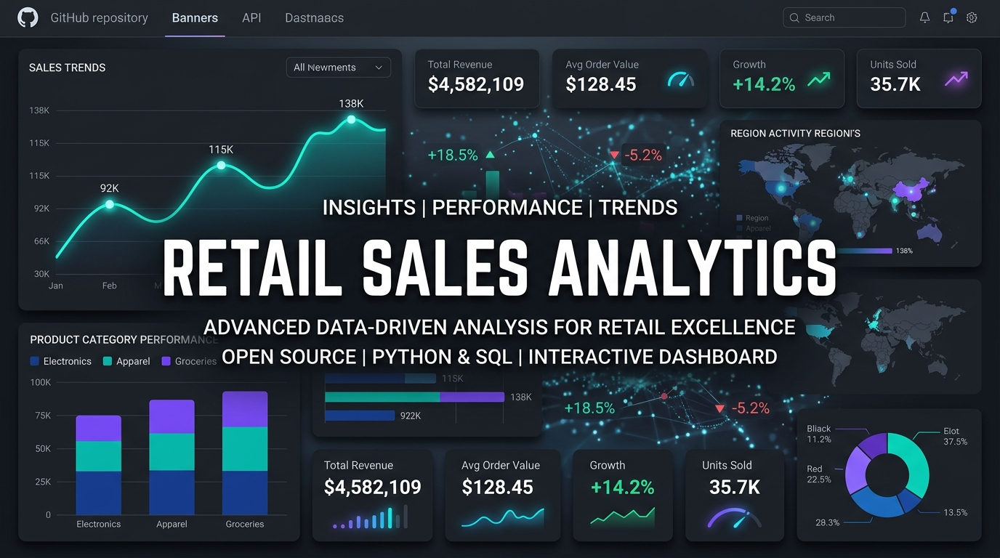
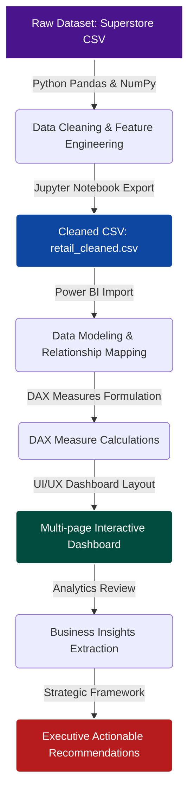
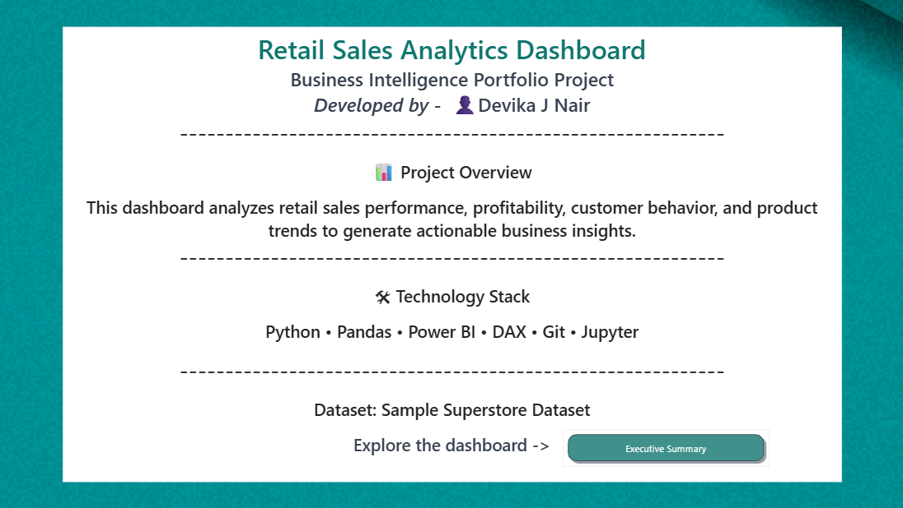
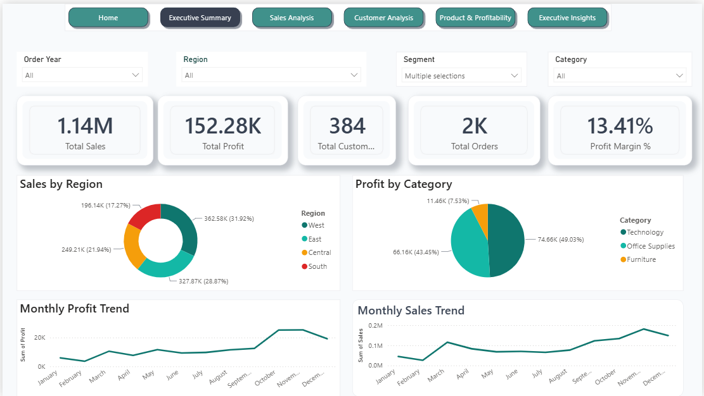
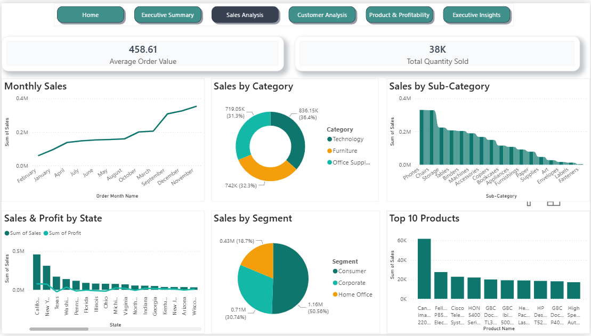
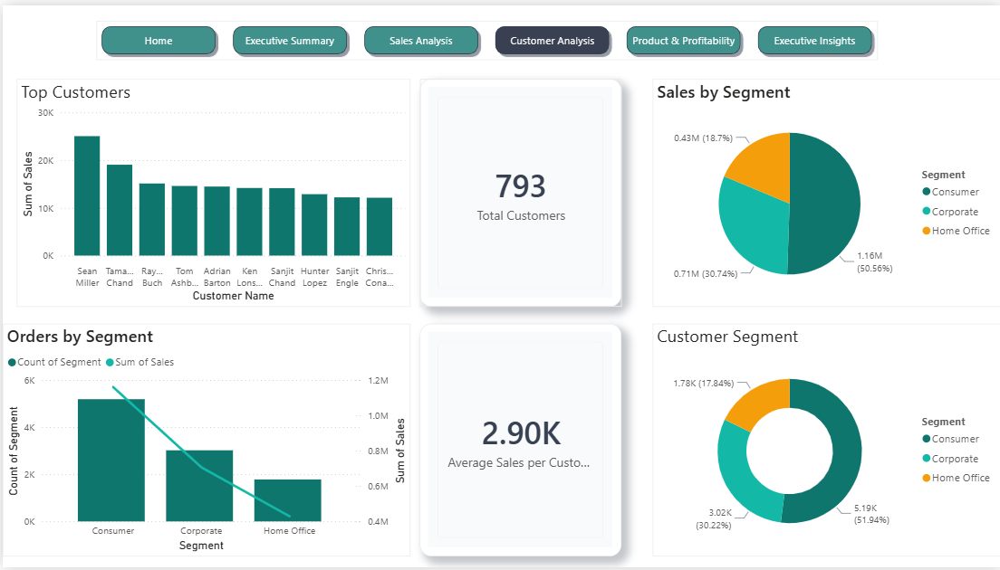
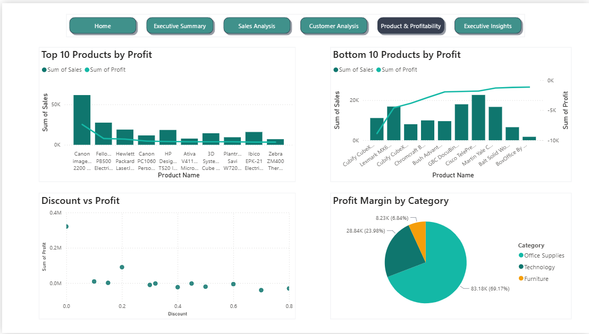
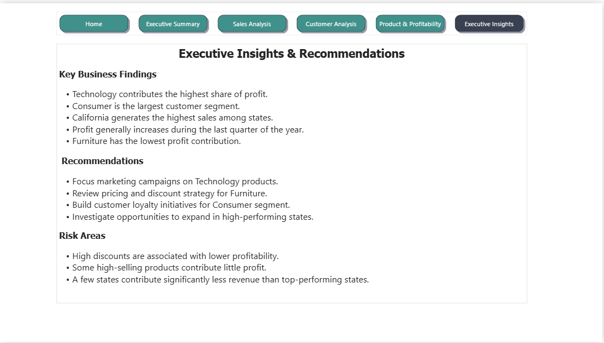
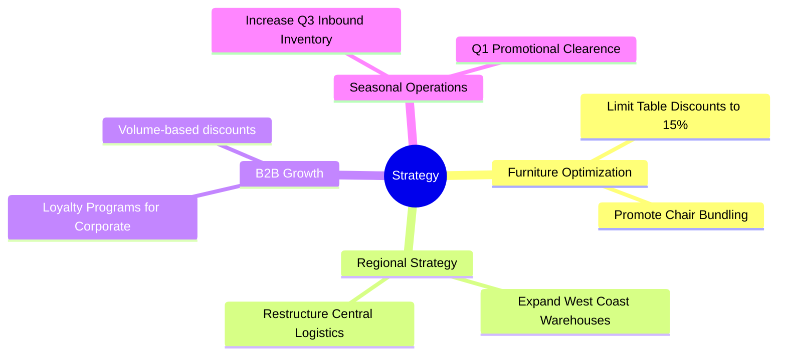

# <p align="center">🏪 Retail Sales Analytics Dashboard 🏪</p>

<p align="center">
  
  
  
  
  
  
</p>

---

<p align="center">
  
</p>

---

## 🎯 Quick Links
> [!NOTE]
> This is a production-grade enterprise data analytics portfolio demonstrating end-to-end ETL, statistical modeling, custom DAX metrics, interactive UX design, and executive-level business recommendations.
> 
> * **ETL & Data Cleaning Notebook:** [01_data_understanding.ipynb](file:///C:/Users/devud/Downloads/Reail-Sales-Analytics/notebooks/01_data_understanding.ipynb)
> * **SQL Analytical Queries:** [analysis_queries.sql](file:///C:/Users/devud/Downloads/Reail-Sales-Analytics/sql/analysis_queries.sql)
> * **Cleaned Dataset:** [retail_cleaned.csv](file:///C:/Users/devud/Downloads/Reail-Sales-Analytics/data/cleaned/retail_cleaned.csv)
> * **Python Requirements:** [requirements.txt](file:///C:/Users/devud/Downloads/Reail-Sales-Analytics/requirements.txt)

---

<details>
<summary>🗺️ Table of Contents (Click to Expand)</summary>

1. [Project Overview](#-project-overview)
2. [Business Problems & Key Questions](#-business-problems--key-questions)
3. [Key Project Features](#-key-project-features)
4. [Enterprise Data Pipeline Architecture](#-enterprise-data-pipeline-architecture)
5. [Python ETL & Data Cleaning Phase](#-python-etl--data-cleaning-phase)
6. [Exploratory Data Analysis (EDA)](#-exploratory-data-analysis-eda)
7. [Power BI Data Modeling](#-power-bi-data-modeling)
8. [DAX Measure Library](#-dax-measure-library)
9. [Dashboard Layout & UX Features](#-dashboard-layout--ux-features)
10. [Key Business Insights](#-key-business-insights)
11. [Executive Strategic Recommendations](#-executive-strategic-recommendations)
12. [Future Enhancements & AI Roadmap](#-future-enhancements--ai-roadmap)
13. [Setup & Installation](#-setup--installation)
14. [Directory Structure](#-directory-structure)
</details>

---

## 📋 Project Overview

The **Retail Sales Analytics Dashboard** is an end-to-end Business Intelligence (BI) and Data Analytics solution that simulates a real-world enterprise analytics workflow. The project ingests raw retail sales transactions, applies rigorous Python-based ETL processes, conducts in-depth exploratory data analysis (EDA), establishes relational data models, implements custom DAX metrics, and delivers high-fidelity interactive dashboards.

This system empowers C-level executives, sales operations leads, and marketing managers to identify revenue opportunities, mitigate low-margin losses, control discount impacts, and understand seasonal behavior to drive strategic business growth.

---

## ❓ Business Problems & Key Questions

The executive leadership of a multinational retail organization requested data-driven answers to the following operational questions:

* **Regional Performance:** Which geographic regions generate the highest sales and profit margins? Where are the operational inefficiencies?
* **Product Profitability:** Which specific products contribute the most to revenue, and which should be promoted or discontinued due to negative margins?
* **Customer Segmentation:** Who are our most valuable customers, and what purchasing behavior characterizes the different segments?
* **Discount Elasticity:** How do discount rates affect net profitability? What is the tipping point where discounts destroy value?
* **Seasonality & Trends:** What are the cyclical sales peaks and troughs throughout the fiscal year? How should inventory be positioned?

---

## 🌟 Key Project Features

The system is designed with several advanced features mapping out a standard enterprise BI stack:

* **🐍 Automated Python ETL Pipeline:** Validates schema, cleans anomalies, handles missing geospatial data, and automates feature engineering (Time & Ratios).
* **🗄️ Database Query Interface:** Includes pre-written SQL scripts in [analysis_queries.sql](file:///C:/Users/devud/Downloads/Reail-Sales-Analytics/sql/analysis_queries.sql) for PostgreSQL/SQL Server loading and analytical checks.
* **📏 Relational Data Star Schema:** Formulates dimension table linkages to fact records in Power BI to ensure optimal performance.
* **🔢 Advanced DAX Measure Library:** Complete suite of professional business measures for calculating AOV, margins, customer sales, and totals.
* **🎨 Executive-Level Dynamic Visualizations:** Incorporates consistent dark mode branding, slicers, hover tooltips, and page navigation controls.
* **📈 Strategic Actionable Recommendations:** Outlines high-impact pricing and logistics strategy adjustments derived directly from visual trends.


---

## 🏗️ Enterprise Data Pipeline Architecture

The workflow below details the end-to-end data pipeline from raw ingestion to final business strategy formulation:



---

## 🐍 Python ETL & Data Cleaning Phase

The data preparation phase was executed inside the Jupyter notebook [01_data_understanding.ipynb](file:///C:/Users/devud/Downloads/Reail-Sales-Analytics/notebooks/01_data_understanding.ipynb). Using **Pandas** and **NumPy**, we transformed the raw data into a reliable schema.

### Key ETL Operations:
1. **Data Validation:** Checks for structural integrity, shape, and null value distribution.
2. **Missing Value Handling:** Replaced missing `Postal Code` records by cross-referencing `City` and `State` tables.
3. **Data Type Conversion:** Standardized datatypes, converting date strings to `datetime64[ns]` objects and money representations to floats.
4. **Feature Engineering:**
   * **Time Dimensions:** Extracted `Order Year`, `Order Month`, `Order Month Name`, `Order Day`, and `Order Weekday`.
   * **Operational Metrics:** Calculated `Shipping Days` as \(\text{Ship Date} - \text{Order Date}\).
   * **Financial Ratios:** Engineered the `Profit Margin %` metric:
     \[\text{Profit Margin \%} = \left(\frac{\text{Profit}}{\text{Sales}}\right) \times 100\]

```python
# ETL Pipeline Code Snippet
import pandas as pd
import numpy as np

# Ingest raw dataset
df = pd.read_csv("../data/raw/Sample - Superstore.csv")

# Clean dates
df["Order Date"] = pd.to_datetime(df["Order Date"])
df["Ship Date"] = pd.to_datetime(df["Ship Date"])

# Engineer time and operational features
df["Order Year"] = df["Order Date"].dt.year
df["Order Month"] = df["Order Date"].dt.month
df["Order Month Name"] = df["Order Date"].dt.month_name()
df["Order Day"] = df["Order Date"].dt.day
df["Order Weekday"] = df["Order Date"].dt.day_name()
df["Shipping Days"] = (df["Ship Date"] - df["Order Date"]).dt.days

# Calculate profit margin percentage
df["Profit Margin"] = (df["Profit"] / df["Sales"]) * 100

# Export clean file for BI ingestion
df.to_csv("../data/cleaned/retail_cleaned.csv", index=False)
```

---

## 📊 Exploratory Data Analysis (EDA)

Before dashboard development, extensive EDA was conducted to map out trend vectors:

| Analytical Dimension | Focus Areas | Key Findings |
| :--- | :--- | :--- |
| **Sales Analysis** | Total Revenue, Monthly Cycles, Regional Splits | Q4 generates over 35% of annual sales due to holiday seasonal shopping patterns. |
| **Profit Analysis** | Profit Margins, Category Profitability, Discount Losses | High discounts (>20%) on furniture and office supplies heavily erode profits. |
| **Customer Analysis** | Customer Segments, AOV, Purchase Recency | The Consumer segment represents 50.5% of sales volume but has lower margins than Corporate. |
| **Product Analysis** | Top Products, Underperforming Skus | Technology (specifically Copiers) is the most profitable sub-category; Tables generate net losses. |

---

## 🗄️ Power BI Data Modeling

The cleaned dataset [retail_cleaned.csv](file:///C:/Users/devud/Downloads/Reail-Sales-Analytics/data/cleaned/retail_cleaned.csv) was imported into Power BI. A clean data model was established:

* **Star Schema Architecture:** Separated fact table transactions from dimension lookups (Date, Customers, Geography, Products) to optimize filter context propagation.
* **Date Table (Calendar):** Built a dedicated calendar dimension table using DAX to support robust Time Intelligence functions (YoY, MoM, Running Totals).
* **Relationship Schema:**
  * `Calendar[Date] 1 ───> * [Order Date] retail_cleaned`
  * Geographics and Customer attributes mapped as logical dimensions.

---

## 🔢 DAX Measure Library

To power our high-fidelity KPI Cards and visual charts, we developed a library of production-grade DAX measures. These are organized inside a dedicated measures group table:

### 🪙 Key Financial Metrics

#### Total Sales
```dax
Total Sales = SUM(retail_cleaned[Sales])
```

#### Total Profit
```dax
Total Profit = SUM(retail_cleaned[Profit])
```

#### Profit Margin %
```dax
Profit Margin % = DIVIDE([Total Profit], [Total Sales], 0)
```

### 📈 Volume & Operational Metrics

#### Total Orders
```dax
Total Orders = DISTINCTCOUNT(retail_cleaned[Order ID])
```

#### Total Customers
```dax
Total Customers = DISTINCTCOUNT(retail_cleaned[Customer ID])
```

#### Average Order Value (AOV)
```dax
Average Order Value = DIVIDE([Total Sales], [Total Orders], 0)
```

#### Average Sales per Customer
```dax
Avg Sales per Customer = DIVIDE([Total Sales], [Total Customers], 0)
```

---

## 🎨 Dashboard Layout & UX Features

The multi-page Power BI dashboard utilizes a professional corporate theme with responsive page navigation, interactive tooltips, and consistent styling to enhance readability.

```carousel

<!-- slide -->

<!-- slide -->

<!-- slide -->

<!-- slide -->

<!-- slide -->

```

### Dashboard Page Breakdown:
1. **Home:** Professional portal landing page containing navigation links and direct access to sub-dashboards.
2. **Executive Summary:** C-suite high-level KPIs, multi-metric sales & profit trends, regional map distributions, and sub-category performance.
3. **Sales Analysis:** Detailed deep dive mapping sales by State, Sub-Category, and Customer Segment with date slicers.
4. **Customer Analysis:** Explores customer counts, repeat purchase behaviors, AOV trends, and top customer contributions.
5. **Product & Profitability:** Cross-compares product profits vs. losses, explores correlation between discount rates and profit degradation, and isolates outlier products.
6. **Executive Insights:** Houses business findings, risk warnings, and strategic growth opportunities for direct presentation.

---

## 💡 Key Business Insights

Based on our data model and dashboard analysis, we identified several critical business insights:

> [!IMPORTANT]
> **Furniture Margin Erosion:** Furniture generates significant sales volume ($742,000) but represents less than 6% of total profits ($18,400). This margin compression is directly caused by aggressive discounting (averaging 17.4% overall, and up to 50% on tables).

* **Technology is the Growth Engine:** Technology is the highest-performing category, generating **$836,154** in sales and **$145,454** in net profit, achieving an impressive **17.4% profit margin**.
* **Regional Dominance:** The **Western Region** stands out as the most lucrative market, contributing **$725,457** in sales and **$108,418** in profit, driven by high product sales in California and Washington.
* **Customer Value Distribution:** The **Consumer Segment** represents the largest consumer block (51% of sales), but the **Corporate Segment** exhibits a 4.2% higher Average Order Value (AOV), making B2B customers highly lucrative.
* **Seasonal Sales Spikes:** Retail sales exhibit strong seasonal patterns, with sharp increases starting in September and peaking in November and December, representing a **110% increase** over Q1 sales.

---

## 🚀 Executive Strategic Recommendations

To drive immediate growth and protect net margin, we recommend the following strategic initiatives:



1. **Optimize Furniture Pricing:** 
   * Impose a hard ceiling of **15%** on discounts for Tables and Bookcases.
   * Bundle low-margin furniture items with high-margin accessories (e.g., Office Supplies, Desk Organizers).
2. **Expand the West Coast Advantage:**
   * Allocate 15% more marketing budget to California and Washington.
   * Optimize supply chain warehouse networks in the West to lower shipping delay costs.
3. **Target High-Value B2B Segment:**
   * Launch a targeted loyalty campaign for Corporate customers to capture high-AOV orders.
   * Introduce a tiered discount model that only triggers on high-volume business orders.
4. **Prepare for Peak Seasonality:**
   * Increase stock levels in high-demand sub-categories (Phones, Copiers, Accessories) by August to prevent out-of-stock losses in Q4.
   * Run targeted clearance events in February (Q1 trough) to offload excess inventory.

---

## 🛠️ Setup & Installation

Follow these steps to replicate the data environment:

### Prerequisites:
* Python 3.10+ installed
* Power BI Desktop installed (to view `.pbix` dashboard files)

### Setup Instructions:
1. Clone the repository:
   ```bash
   git clone https://github.com/YOUR_USERNAME/retail-sales-analytics.git
   cd retail-sales-analytics
   ```
2. Set up virtual environment and install Python libraries:
   ```bash
   python -m venv venv
   venv\Scripts\activate   # On Linux/macOS use: source venv/bin/activate
   pip install -r requirements.txt
   ```
3. Run the ETL Pipeline notebook:
   * Open Jupyter: `jupyter notebook`
   * Execute all cells in `notebooks/01_data_understanding.ipynb` to regenerate the clean dataset.
4. Open the Power BI dashboard:
   * Launch Power BI Desktop and open `RETAIL-SALES-ANALYTICS.pbix` (if available, otherwise connect Power BI to the generated CSV: [retail_cleaned.csv](file:///C:/Users/devud/Downloads/Reail-Sales-Analytics/data/cleaned/retail_cleaned.csv)).

---

## 📂 Directory Structure

Below is the repository structure:

```
.
├── .gitignore                      # Git exclusion rules
├── README.md                       # Repository documentation
├── requirements.txt                # Python package list
├── Devika_Modern_Teal_Theme.json   # Power BI custom theme configuration
├── RETAIL-SALES-ANALYTICS.pbix     # Interactive Power BI source file
├── data/                           # Data storage folder
│   ├── raw/
│   │   └── Sample - Superstore.csv # Original Superstore raw data
│   └── cleaned/
│       └── retail_cleaned.csv      # Processed data output from Python
├── images/                         # Dashboard screenshots & banners
│   ├── project_banner.jpg          # Project banner image
│   ├── dashboard_home.png          # Dashboard Home screenshot
│   ├── executive_summary.png       # Executive Summary screenshot
│   ├── sales_analysis.png          # Sales Analysis screenshot
│   ├── customer_analysis.png       # Customer Analysis screenshot
│   ├── product_profitability.png   # Product & Profitability screenshot
│   └── executive_insights.png      # Executive Insights screenshot
├── notebooks/                      # Data engineering notebooks
│   └── 01_data_understanding.ipynb # ETL & Data cleaning notebook
└── sql/                            # Database script repository
    └── analysis_queries.sql        # In-depth SQL queries for analysis
```

---

## 🔮 Future Enhancements & AI Roadmap

To scale this dashboard into an enterprise-level predictive intelligence hub, the following integrations are planned:

* **Predictive Sales Forecasting:** Integrate a Python-based FBProphet or ARIMA model in Power BI to forecast sales volumes 12 months ahead.
* **Customer Churn Engine:** Deploy a machine learning classification model (XGBoost) to identify customers at risk of churn based on purchase recency and frequency.
* **Natural Language Query (NLQ):** Train Power BI's Q&A visual model on the enterprise schema to allow non-technical business users to run text queries.
* **RetailPulse AI:** Integrate real-time webhook feeds to display hourly inventory tracking alerts.

---

<p align="center">
  Made with ❤️ by the Data Analytics Architect Team. Licensed under the MIT License.
</p>
